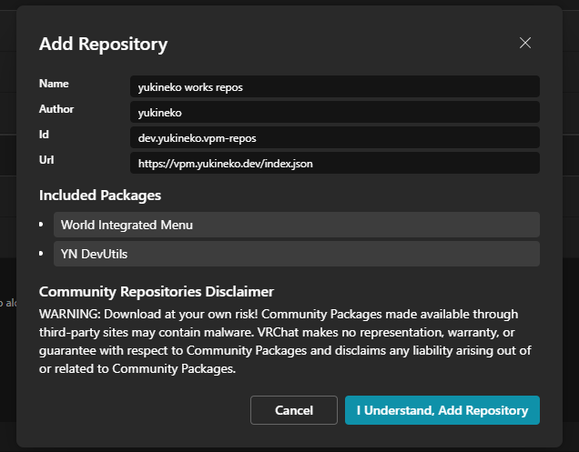
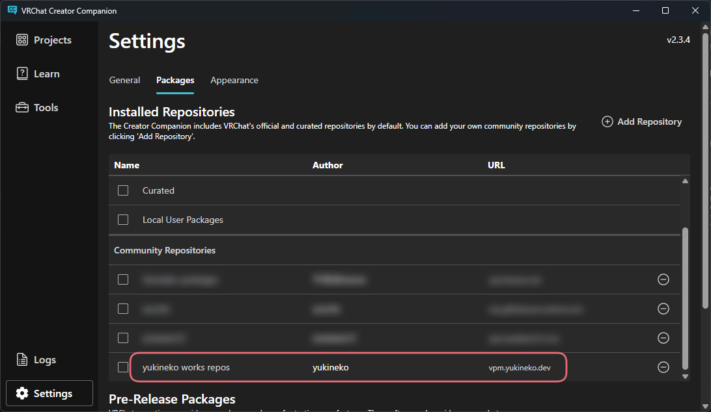

# VCCへの追加方法
まずは[トップページ](/)に移動し、「VCCに追加」ボタンをクリックしてください。  
すると以下のようなダイアログが表示されるので、「I Understand, Add Repository」をクリックしてください。  

Installed Repositoriesに「yukineko works packages」が追加されていれば、VCCへの追加は完了です。
