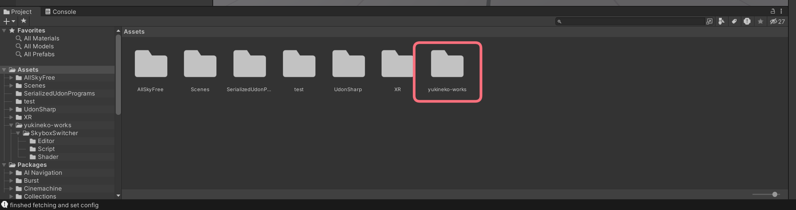
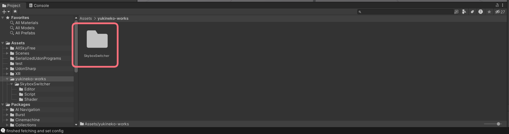
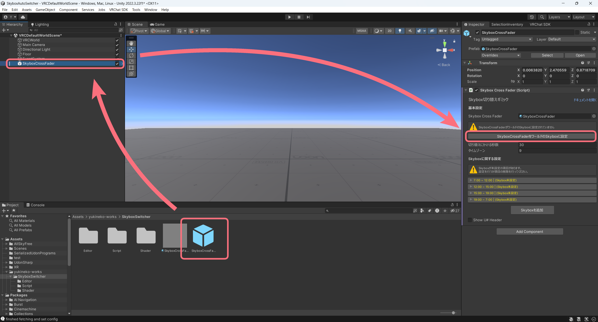

# 導入方法
[[toc]]  
  
::: info
ワールド自体はすでにセットアップされていることを前提として記載しています
:::

## 1. ギミックの導入
このギミックを導入したいワールドをあらかじめUnityで開いたうえで、Boothからダウンロードしたzipの中にある `SkyboxSwitcher-x.x.x.unitypackage` をインポートしてください。  

## 2. ギミックの配置
インポートに成功したら、エディタ下部にあるProjectsからアセットを配置します。  
まずはAssets内にある`yukineko-works`フォルダを開き、更に`SkyboxSwitcher`フォルダを開きます。    
  
  

その後、Prefab `SkyboxCrossFader` をHierarchy内にドラックアンドドロップし、Inspectorにある「Skybox切り替えギミック」内の「SkyboxCrossFaderをワールドのSkyboxに設定」ボタンをクリックします。  
  
  
これで導入は完了です。  
このギミックに関する詳細設定については[設定ページ](./settings)をご覧ください。  