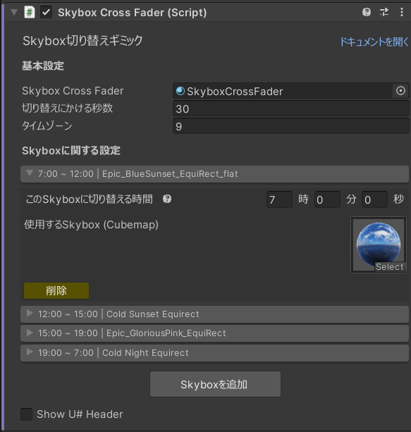

# 設定
[[toc]]

  

## 基本設定
### SkyboxCrossFader
テクスチャのコントロールを行うMaterialを設定します。  
基本的には変更しないでください。  

### 切り替えにかける秒数
Skyboxの切り替えにかける秒数を指定することができます。  

### タイムゾーン
Skyboxの切り替えの基準となる時間のタイムゾーンを指定することができます。  
UTCとのオフセットを指定してください。  
日本であれば 9 のままで問題ありません。  

## Skyboxに関する設定
Skyboxを切り替える時間と、使用するSkyboxを設定することができます。  

### このSkyboxに切り替える時間
このSkyboxに切り替える時間を指定できます。  

::: tip
それぞれのフィールド間 (時, 分, 秒) は左右の矢印キーで移動できます
:::

### 使用するSkybox (Cubemap)
使用するSkyboxのテクスチャを指定できます。  