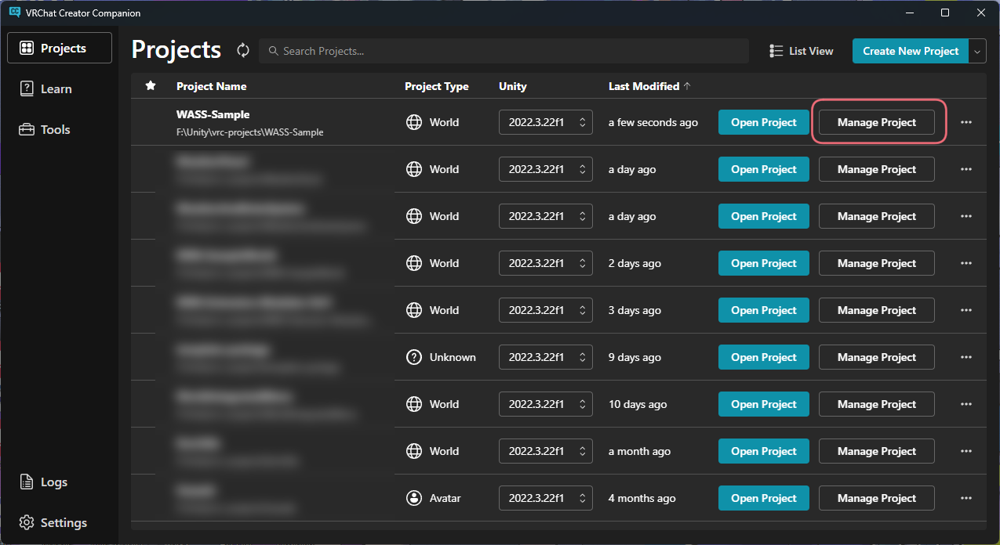
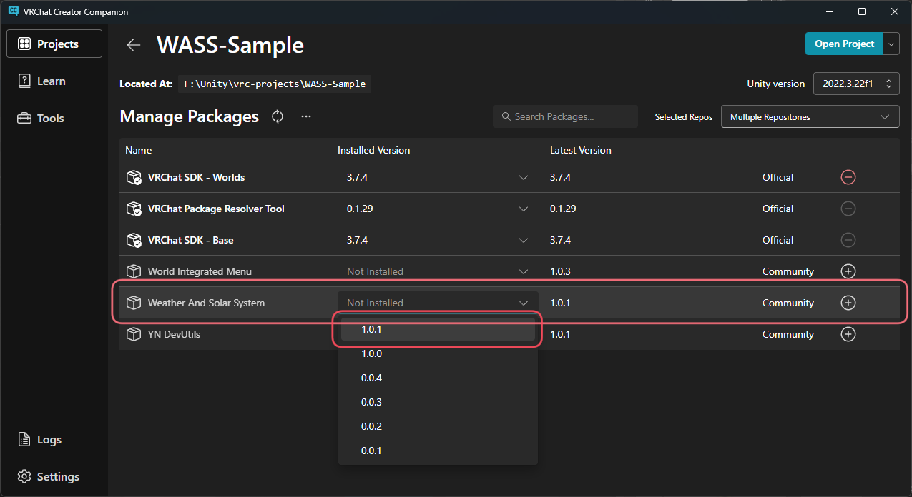
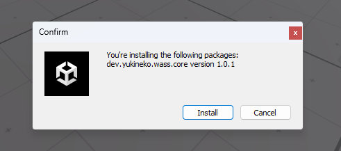
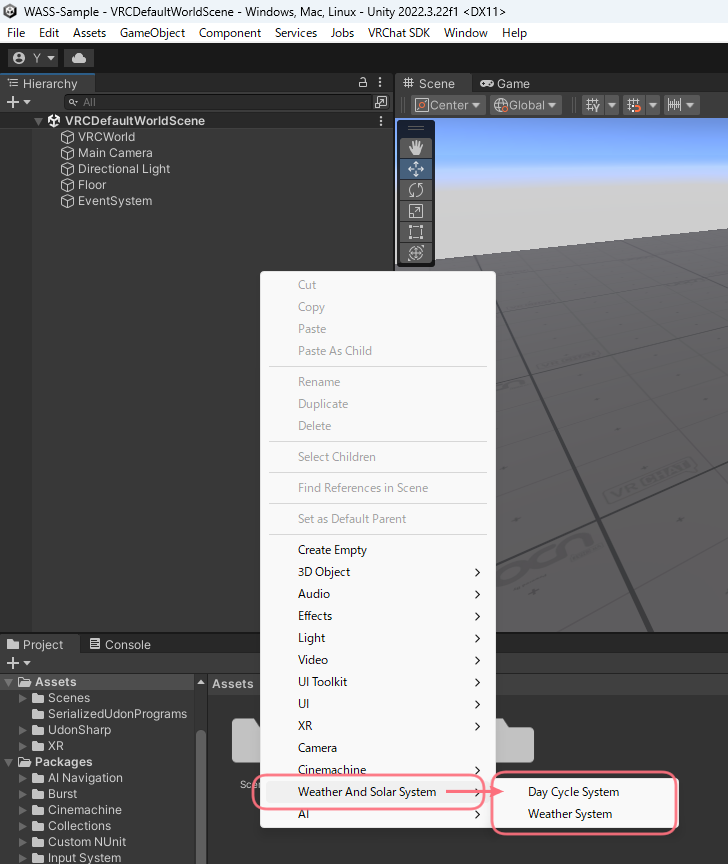
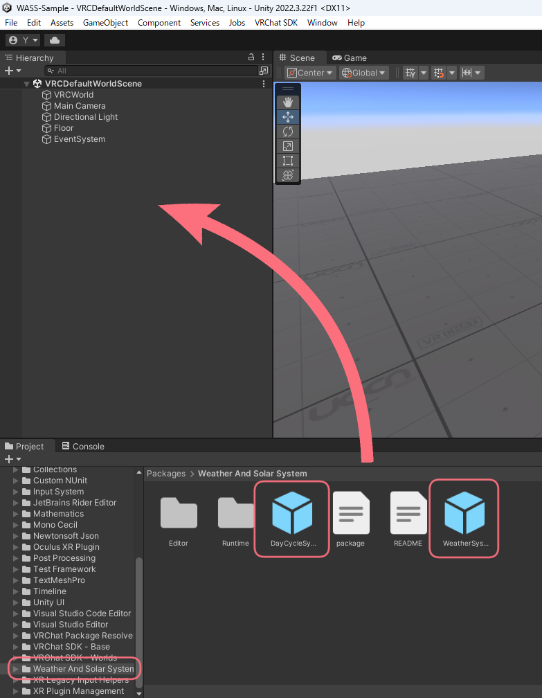

# 導入方法
[[toc]]

## インストール
### VCCからのインストール
VCCからWIMを導入したいプロジェクトの「Manage Project」を選択します。  

Manage Packages内にある「Weather And Solar System」のInstalled Versionから最新のバージョンを選択します。  
::: tip
「Weather And Solar System」パッケージが表示されていない場合は、リポジトリが追加されていない可能性があります。  
リポジトリの追加方法については[VCCへの追加方法](/docs/add-to-vcc)を参照してください。
:::

### UnityPackageからのインストール
Boothからダウンロードしたzipの中にある `wass-installer.unitypackage` をインポートしてください。  
Weather And Solar Systemをインストールするかどうかを聞かれるので、Installをクリックしてください。  

これで導入は完了です。

## ギミックの配置
### メニューから設置
Hierarchy内で右クリックし、`Weather And Solar System` > `Weather System` または `Day Cycle System` を選択します。

### Projectから設置
Projectから `Packages` > `Weather And Solar System` を選択し、Prefab `Weather System` または `Day Cycle System` をHierarchyにドラッグ&ドロップします。

これでギミックの配置は完了です。  
ギミック本体の設定については[次のページ](./settings)を参照してください。
