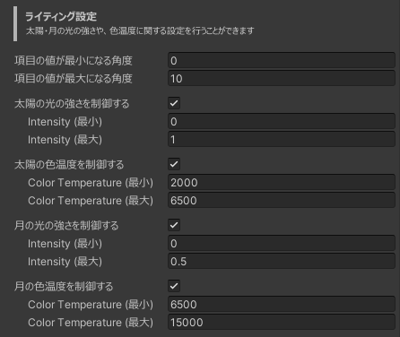

# 設定
[[toc]]

## 天候システム

### 天気に関する設定
#### 天気が変わる間隔 (分) 
天気が変わる間隔を設定します。  
最小1分まで指定可能です。

#### 月ごとの晴天確率 (%)
月ごとの晴天確率を設定します。  
天気の抽選に使用され、ここで設定された値の確率で晴天になります。

### GameObjectに関する設定 {#weather-assets}
天気に応じて有効にするGameObjectを設定できます。  
なお、それぞれの天気の項目欄にある「+」ボタンをクリックすることで、GameObjectの選択欄を追加できます。  

### Skyboxに関する設定
Skyboxの雲の量を天気に応じて変更できます。  
なお、[対応しているSkybox](./supported-skybox)が設定されている必要があります。

### その他の設定
#### シード値
天気の抽選に使用される乱数のシード値を設定できます。  
この値を変更することで、このギミックを導入している他のワールドと異なる(または同じ)天気にすることができます。  

## リアルタイム太陽システム

### 基本設定
#### Directional Light (太陽) {#directional-light-sun}
太陽の動きを制御するDirectional Lightを設定します。  
この項目の設定は必須です。  

#### Directional Light (月)
月の動きを制御するDirectional Lightを設定します。(任意)

### 太陽の位置に関する設定
#### 緯度 / 経度
太陽の位置の計算に使用される緯度と経度を設定します。  
初期設定は東京です。  

#### タイムゾーン
太陽の位置の計算に使用されるタイムゾーンを設定します。  
初期設定は日本標準時(+9)です。

#### 角度補正
太陽が昇ってくる(または沈んでいく)方向を補正するための角度を設定します。  

### ライティング設定

太陽または月として設定されているDirectional Lightのライティング設定を行います。  
光の強さ、色温度は `項目の値が最大になる角度` と `項目の値が最小になる角度` [^1] の間で補間されます。

[^1]: 太陽または月の高度を指し、TransformのRotationのX軸の値に対応します。

### その他の設定
#### 更新頻度 (秒)
太陽と月の位置や、ライティングのパラメータを更新する頻度を設定します。  
値を大きくするほど変化が目立ちやすくなるため、できるだけ小さな値に設定することをおすすめします。  

#### デバッグモード / 時間調整
デバッグモードを有効にすると時間調整が可能になります。  
角度補正などを設定する際にお使いください。  
なお、デバッグモードはワールドアップロード時に無効になります。  