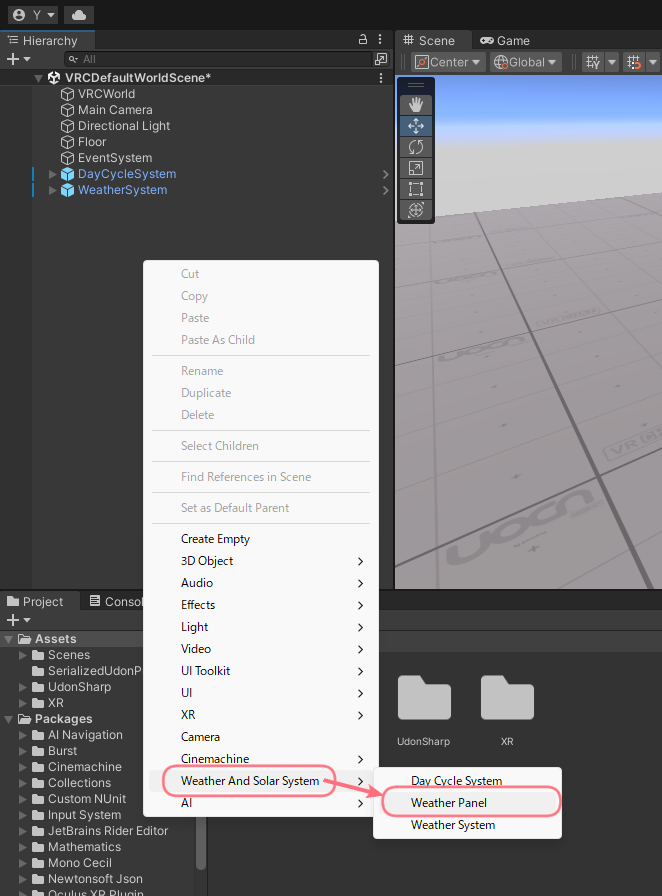
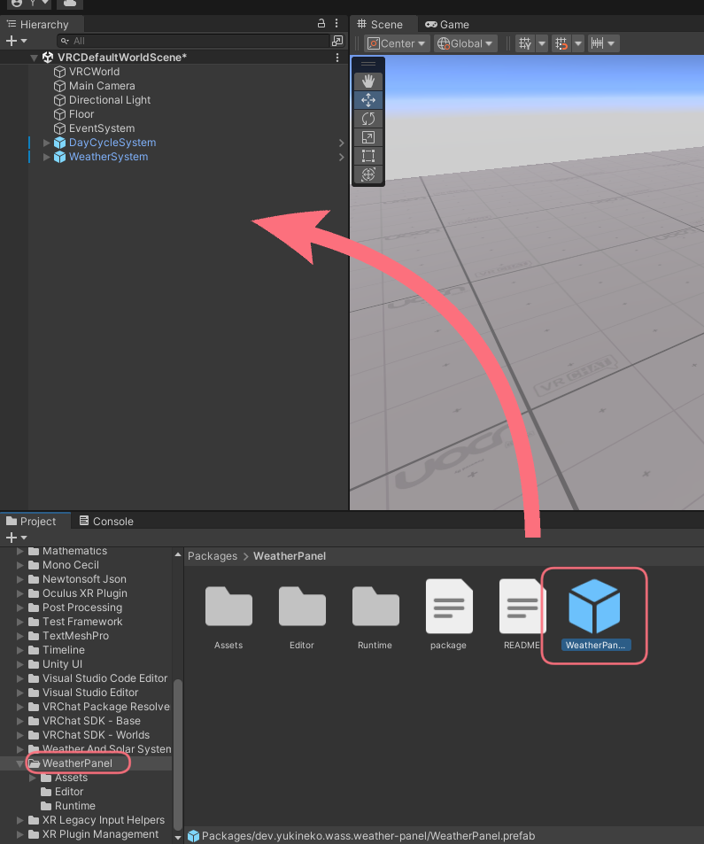

# 導入方法
[[toc]]

## インストール
Boothからダウンロードしたzipの中にある `dev.yukineko.wass.weather-panel-x.x.x.unitypackage` をインポートしてください。  

## ギミックの配置
### メニューから設置
Hierarchy内で右クリックし、`Weather And Solar System` > `Weather Panel` を選択します。

### Projectから設置
Projectから `Packages` > `WeatherPanel` を選択し、Prefab `Weather Panel` をHierarchyにドラッグ&ドロップします。

これでギミックの配置は完了です。  
ギミック本体の設定については[次のページ](./settings)を参照してください。
