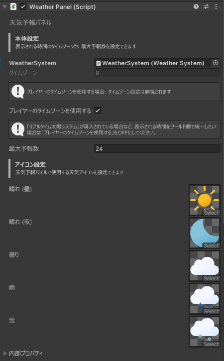

# 設定
[[toc]]

## 本体設定
### WeatherSystem
既にHierarchyに配置されているWeatherSystemを指定します。  

### タイムゾーン
天気予報を表示する際に使用される時間のタイムゾーンを指定します。  

::: tip
「プレイヤーのタイムゾーンを使用する」が有効になっている場合は、この設定は無視されます。
:::

### プレイヤーのタイムゾーンを使用する
天気予報を表示する際に使用される時間のタイムゾーンを、プレイヤーのタイムゾーンに設定します。    

::: tip
「リアルタイム太陽システム」が導入されている場合など、表示される時間をワールド側で統一したい場合は「プレイヤーのタイムゾーンを使用する」をOFFにしてください。
:::

### 最大予報数
表示する天気予報の最大数を指定します。  

## アイコン設定
天気予報パネルで使用される天気アイコンを設定することが出来ます。
