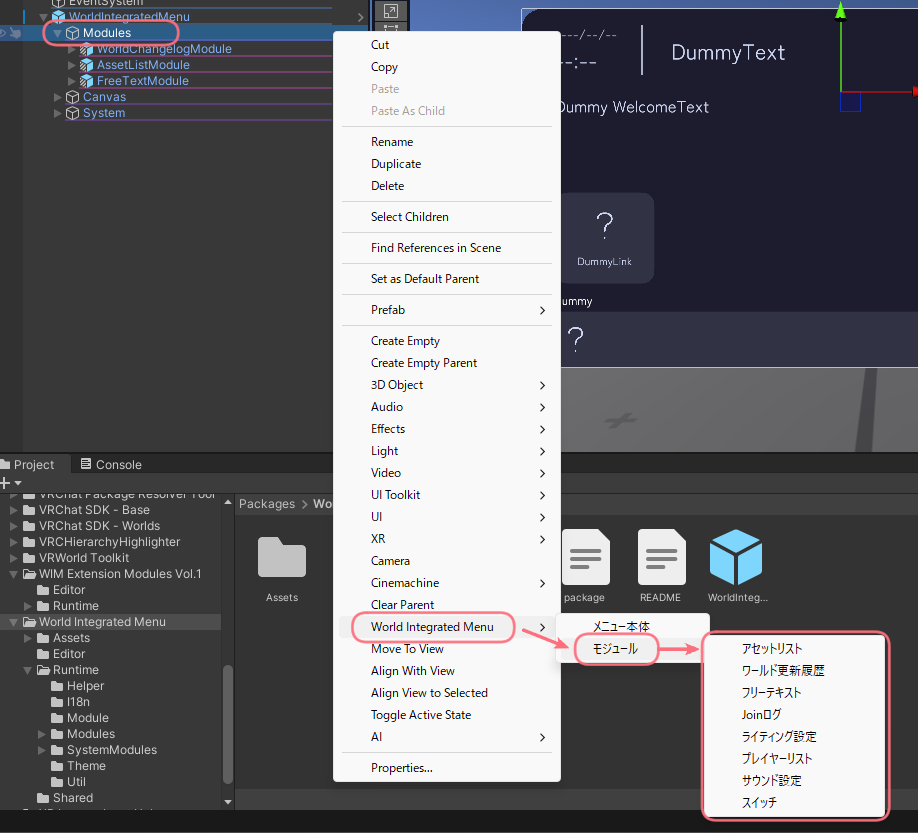
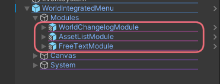

# モジュールの追加方法

[[toc]]

## メニューから追加する
WIMのメニューからモジュールを追加することができます。  
詳しくは[設定ページの「モジュール設定」](./settings#module)をご覧ください。  

## Hierarchyから追加する (非推奨)
WIMのModulesオブジェクトを右クリックし、表示されるメニューからモジュールを追加することができます。

## 直接配置する (非推奨)
モジュールをWIMのModulesオブジェクト直下に配置することで、直接追加することができます。  

なお、モジュールのprefabは以下のディレクトリに配置されています。  
標準モジュール[^1]: `Packages` > `World Integrated Menu` > `Runtime` > `Modules`  
拡張モジュール: `Packages` > `WIM Extension Modules Vol.X` > `Runtime`

[^1]: アセットリストモジュール, フリーテキストモジュール, ワールド変更履歴モジュール