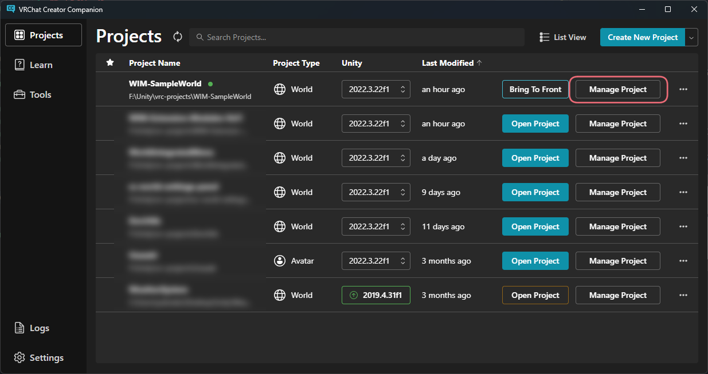
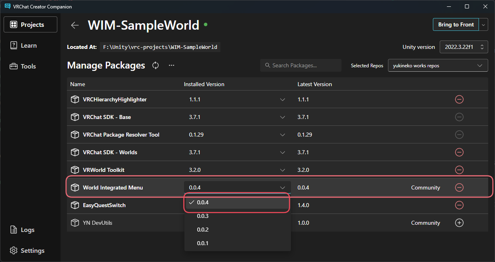
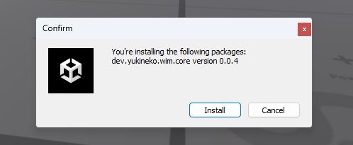
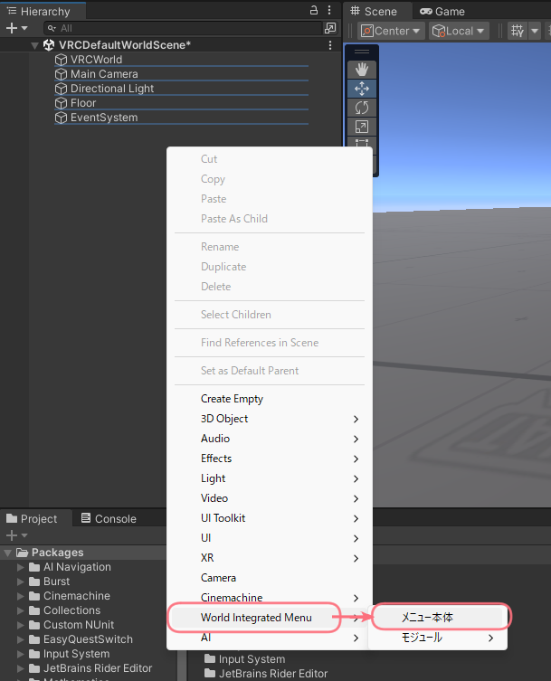
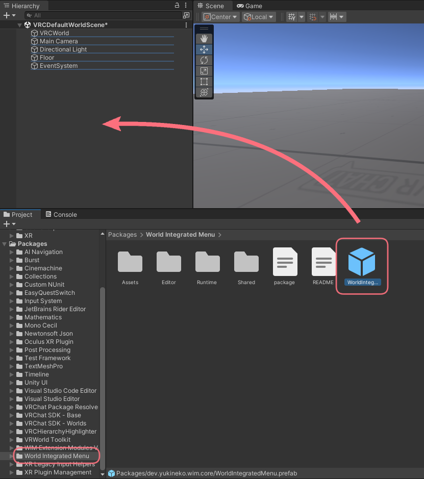

# 導入方法
[[toc]]

## インストール
### VCCからのインストール
VCCからWIMを導入したいプロジェクトの「Manage Project」を選択します。  

Manage Packages内にある「World Integrated Menu」のInstalled Versionから最新のバージョンを選択します。  

これで導入は完了です。

::: tip
「World Integrated Menu」パッケージが表示されていない場合は、リポジトリが追加されていない可能性があります。  
リポジトリの追加方法については[VCCへの追加方法](/docs/add-to-vcc)を参照してください。
:::

### UnityPackageからのインストール
Boothからダウンロードしたzipの中にある `wim-installer.unitypackage` をインポートしてください。  
WIMをインストールするかどうかを聞かれるので、Installをクリックしてください。  

これで導入は完了です。

## ギミックの配置
### メニューから設置
Hierarchy内で右クリックし、`World Integrated Menu` > `メニュー本体` を選択します。

### Projectから設置
Projectから `Packages` > `World Integrated Menu` を選択し、Prefab `WorldIntegratedMenu` をHierarchyにドラッグ&ドロップします。

これでギミックの配置は完了です。  
ギミック本体の設定については[次のページ](./settings)を参照してください。
