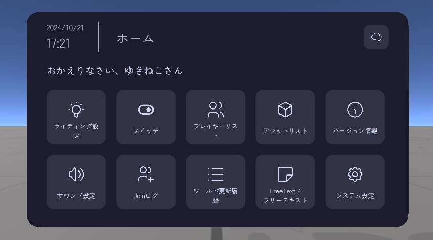

# ワールド統合メニュー (World Integrated Menu) とは
  

<Booth link="https://yukineko-works.booth.pm/items/6248278" :isFree="true" />  
<VPMLink />

ワールド統合メニュー (World Integrated Menu / WIM) はVRChat用のワールドギミックです。  
「ワールドによくある機能をひとまとめに、簡単に導入出来る」ことを目標として開発しました。  

::: tip サンプルワールド
このギミック本体と、現在公開されている全ての拡張モジュールの動作を確認することができます。  
https://vrchat.com/home/launch?worldId=wrld_5d12971f-e010-4792-a06a-91342d0e6fc2  
:::

## できること
- 必要な機能だけを導入できる (モジュール式)  
    - ライティング設定機能やBGMの音量調整機能など[^1]
- 手元にメニューを呼び出して設定を変更できる
- 多言語に対応
- 配色 (テーマ) をカスタマイズできる
- 簡単に導入、設定できるように設計 (ワールド制作者向け)

## 拡張モジュール
ワールド統合メニューは拡張モジュールを導入することで、さらに機能を追加することができます。  
例として、以下のような機能があります。  

- スイッチ機能 (ミラーやコライダーなどのオブジェクトのON/OFF切り替えなど)
- ライティング設定 (ワールドの明るさやナイトモードの設定など)
- サウンド設定 (BGMのON/OFFや音量調整など)
- Joinログの表示 (参加/退出した日時の記録など)
- プレイヤー一覧の表示 (現在インスタンスにいるユーザーのプラットフォーム表示/参加時間/オーナー表示など)

詳しくは[拡張モジュール一覧](/docs/wim-modules/intro)をご覧ください。

[^1]: 一部の機能は別売りのモジュールを導入する必要があります