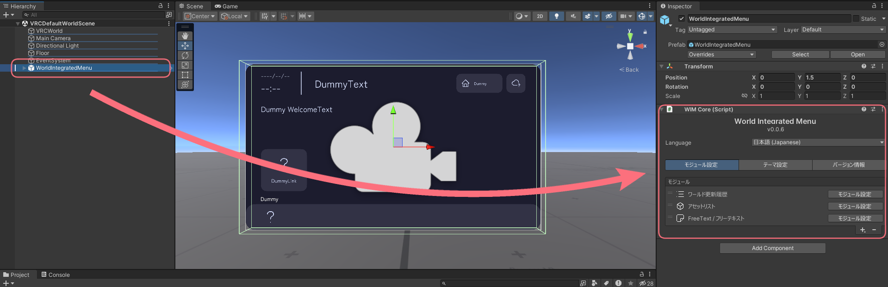
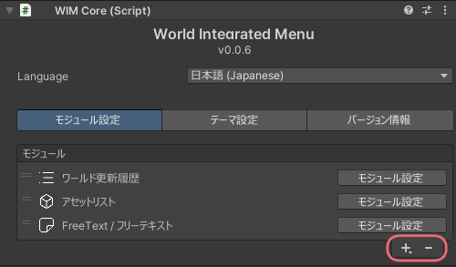
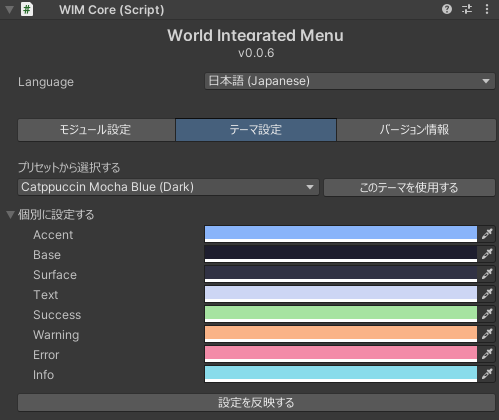
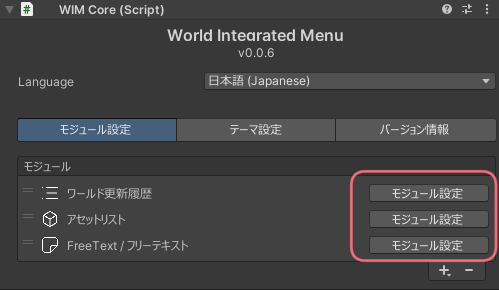
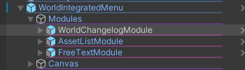

# 設定
[[toc]]

## メニューに関する設定
WIMに関する設定はWorld Integrated Menuオブジェクト(Prefab)のInspectorから行うことができます。

### Language
メニューの表示言語を選択することができます。

### モジュール設定 {#module}
メニューで使用できる機能 (モジュール) を設定することができます。  
右下の「+」ボタンからモジュールの追加、「-」ボタンからモジュールの削除ができます。  
また、それぞれのモジュールをドラッグすることで並び替えが可能です。  
  

### テーマ設定
WIMの配色を変更することができます。  
プリセットから選択するか、個別に配色を設定することができます。  

## モジュールに関する設定
モジュールごとに個別の設定がある場合があります。    
モジュール自体の設定を変更するには、WIMのメニューのモジュール設定から、設定を変更したいモジュールの「モジュール設定」ボタンをクリックします。  

または、`WorldIntegratedMenu` > `Modules`オブジェクト内にあるモジュールを選択することで、Inspectorから設定を変更することができます。
