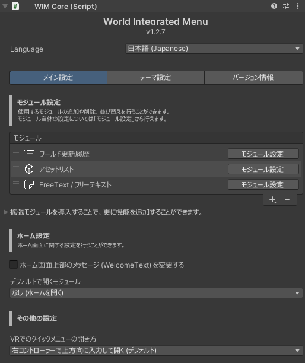

# 設定
[[toc]]

## メニューに関する設定
WIMに関する設定はWorld Integrated Menuオブジェクト(Prefab)のInspectorから行うことができます。

### Language
メニューの表示言語を選択することができます。

### メイン設定

#### モジュール設定 {#module}
メニューで使用できる機能 (モジュール) を設定することができます。  
右下の「+」ボタンからモジュールの追加、「-」ボタンからモジュールの削除ができます。  
また、それぞれのモジュールをドラッグすることで並び替えが可能です。  
  

#### ホーム設定

#####  ホーム画面上部のメッセージ (WelcomeText) を変更する
- デフォルトのメッセージ「おかえりなさい、〇〇さん」を好きなテキストに変更できます。
- `<NAME>` と記述した箇所はプレイヤーの名前に置き換えられます。 (例: `こんばんは、<NAME>さん` -> `こんばんは、ユーザーさん`)

##### デフォルトで開くモジュール
初期化完了時 (ワールドJoin時) にデフォルトで開くモジュールを指定できます。  

#### その他の設定 {#other}
##### VRでのクイックメニューの開き方
ワールドデフォルトの挙動として「スティックを上方向に入力して開く」または「トリガーを素早く2回押して開く」から選択できます。
  

### テーマ設定
WIMの配色を変更することができます。  
プリセットから選択するか、個別に配色を設定することができます。  

### バージョン情報
WIM本体およびモジュールのバージョンを確認することができます。  
また、VRChatPackageResolverToolが導入されている場合は、WIMの新しいバージョンがあるかを確認することができ、ここからアップデートを行うこともできます。  
なお、モジュールに関してはPackageResolverToolが導入されていなくても新しいバージョンがあるかを確認できますが、アップデートはBOOTHからダウンロードする必要があります。  
  

## モジュールに関する設定
モジュールごとに個別の設定がある場合があります。    
モジュール自体の設定を変更するには、WIMのメニューのモジュール設定から、設定を変更したいモジュールの「モジュール設定」ボタンをクリックします。  

または、`WorldIntegratedMenu` > `Modules`オブジェクト内にあるモジュールを選択することで、Inspectorから設定を変更することができます。
