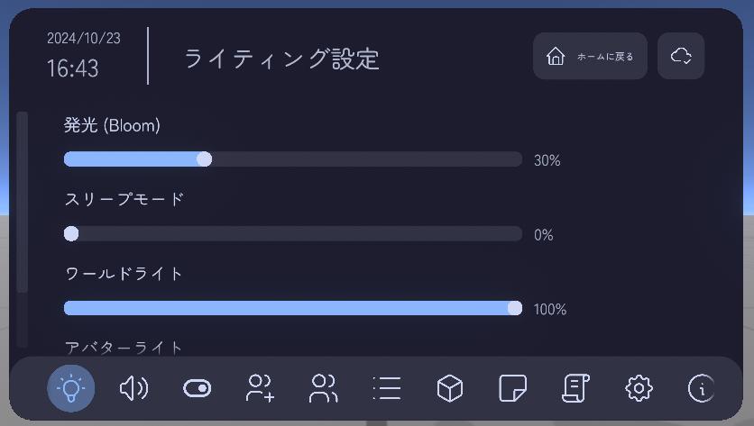
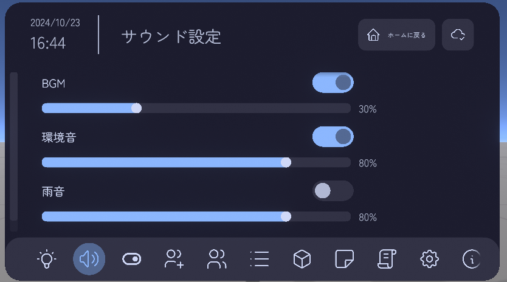
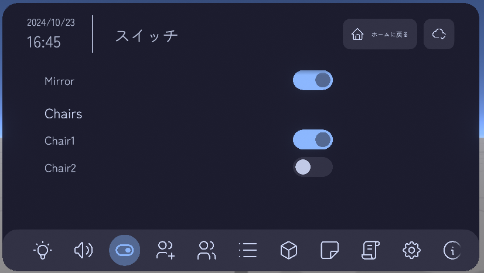
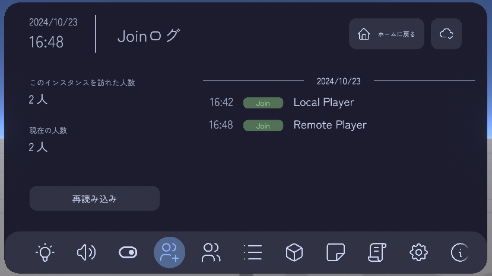
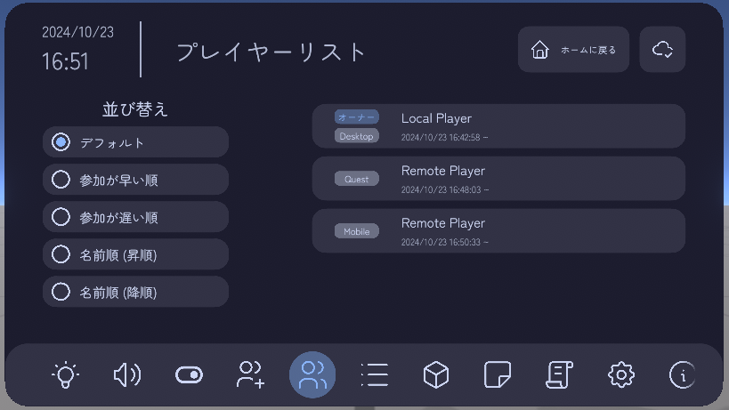
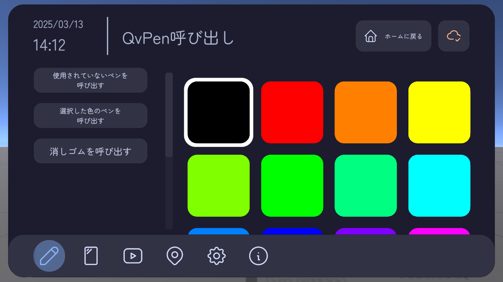
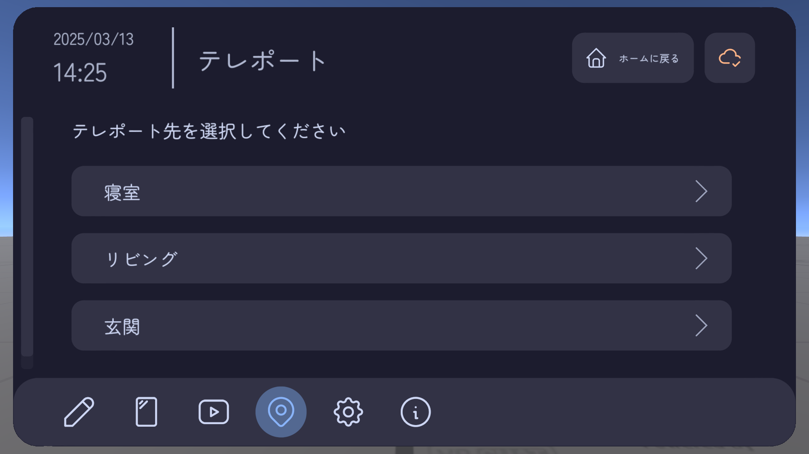
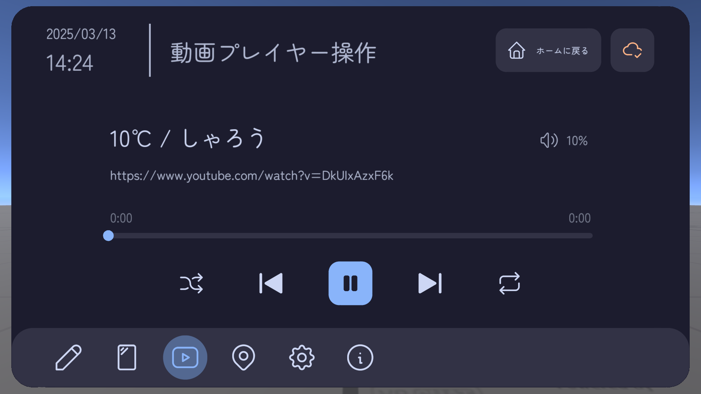
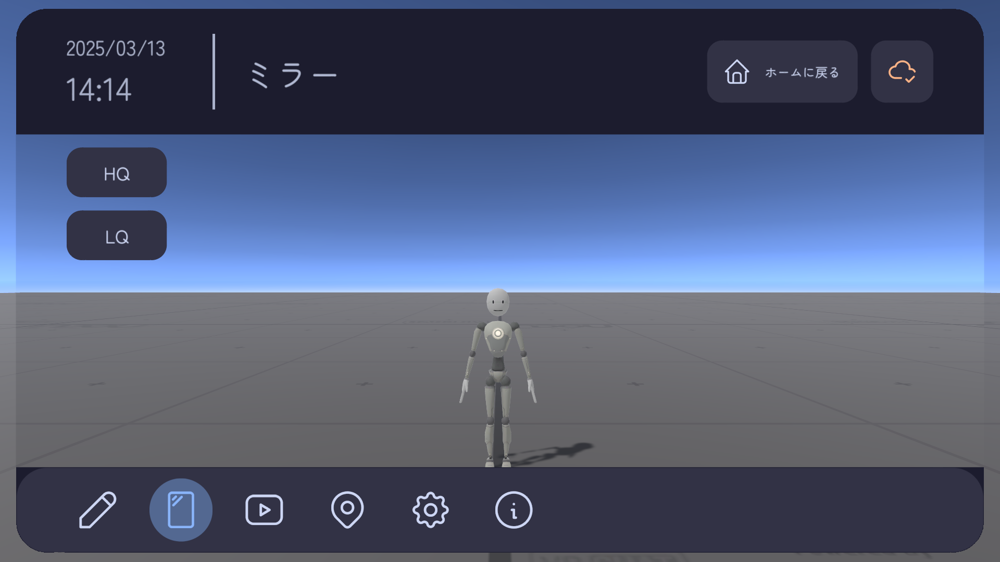

# このギミックについて
World Integrated Menuの機能を拡張するモジュールパックです。  
現在、以下の拡張モジュールがリリースされています。

[[toc]]

::: tip サンプルワールド
ここに掲載されている全ての拡張モジュールは、以下のサンプルワールドにてお試しいただけます。
https://vrchat.com/home/launch?worldId=wrld_5d12971f-e010-4792-a06a-91342d0e6fc2  
:::

::: info
ここに掲載されているモジュール以外にも、新しいモジュールのリリースを予定しています。
:::

## WIM拡張モジュール Vol.1

<Booth link="https://yukineko-works.booth.pm/items/6248326" />  

### ライティング設定
ワールドのライティング設定を変更できるモジュールです。  
Bloom、スリープモード、ワールドライト、アバターライトの設定が可能です。  

### サウンド設定
ワールドのサウンドに関する設定を変更できるモジュールです。  
BGMなどのON/OFFや音量調節を行うことができ、BGMや環境音などの項目は無制限に追加することができます。  

### スイッチ
オブジェクトやコライダーの有効/無効の切り替えを行ったり、オブジェクトのTransformを操作することができるモジュールです。  
項目は無制限に追加することができます。  

### Joinログ
ワールドに入室、退出したプレイヤーのログを表示するモジュールです。  
インスタンスができてからワールドに入室した人数の合計や現在の人数、入室/退出時間を確認することができます。  

### プレイヤー一覧
現在ワールドに居るプレイヤーの一覧を表示するモジュールです。  
プレイヤーの現在のプラットフォームやワールドに入室した時間などを確認することができます。  

## WIM拡張モジュール Vol.2

<Booth link="https://yukineko-works.booth.pm/items/6697590" />

### QvPen呼び出し
QvPenを手元に呼び出すことができるモジュールです。  
使用されていないペンの中からランダムに呼び出す機能や、色を指定してペンを呼び出す機能があります。  
VRであれば利き手を設定し、どちらの手元に呼び出すかを設定することもできます。  

### テレポート
ワールド内の事前に設定された地点にテレポートすることができるモジュールです。  
テレポート先は無制限に追加することができます。  

### 動画プレイヤー操作
[対応している動画プレイヤー](settings/videoplayer-controller#player-list)を操作することができるモジュールです。  
再生/一時停止、再生位置の変更(シーク)などを行うことができます。  

### ミラー
ミラーを使用することができるモジュールです。  
HQ/LQの切り替えを行うことができます。  
