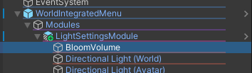
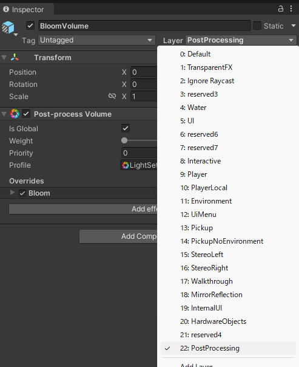

# ライティング設定モジュール

## 設定項目
  

### Bloom (発光)
PostProcessのBloomの強さを変更することができます。  
この項目を使用するためには、[PostProcessのセットアップ](#post-process)が必要です。
::: info
この項目はQuestでは使用できません。
:::

### ナイトモード
睡眠用のナイトモードの強さを変更することができます。

### DirectionalLight (ワールド)
ワールドのライティングの強さを変更することができます。

### DirectionalLight (アバター)
アバターへのライティングの強さを変更することができます。

## 設定の永続化について (Persistence)
ナイトモードを除く、各設定欄にある「値を永続化する」にチェックをつけることで、設定を永続化することができます。  

## PostProcessのセットアップ {#post-process}
- [自動でセットアップを行う](#auto-setup)
- [手動で設定する](#manual-setup)
::: info
Bloomの設定を無効にする場合、または既にPostProcessのセットアップを行ってある場合は、以下の設定を行う必要はありません
:::

### おまかせセットアップを行う {#auto-setup}
ライティング設定モジュールのオブジェクトには以下のようなコンポーネントが追加されています。  
  

このコンポーネントの「おまかせセットアップ」を押すことで、レイヤーのセットアップとカメラへのPost-process Layerの設定が自動で行われます。  
以下のようなメッセージが表示されたら、セットアップは完了です。  
  

### 手動で設定する {#manual-setup}
#### レイヤーの作成
まずは適当なオブジェクトを選択してください。  
Inspectorの右上にある「Layer」から「Add Layer...」をクリックし、新しいレイヤーを作成します。  
  

空いているレイヤー (今回はUser Layer 22) にレイヤー名 `PostProcessing` を入力します。  
  

#### カメラの設定を行う
VRC上で使用するカメラ (デフォルトでは`Main Camera`)を選択し、InspectorのAdd Componentから `Post-process Layer` を追加します。  
  

`Post-process Layer` のLayerから、先ほど作成したレイヤー (ここでは `PostProcessing` ) を選択します。  
  

#### BloomVolumeのレイヤー設定を行う
Hierarcheyから `LightSettingsModule` を開き、子要素の `BloomVolume` を選択します。  
  

Inspectorの右上にあるLayerから先ほど作成したレイヤー (ここでは `PostProcessing` ) を選択します。 
  

以上でPostProcessの設定は完了です。  