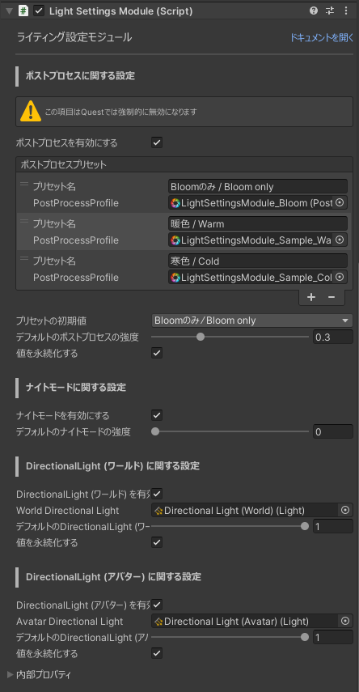
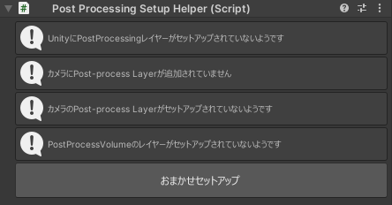

# ライティング設定モジュール

## 設定項目
  

### ポストプロセスに関する設定 {#post-process-setting}
ワールドに適用するPostProcessのプリセットを追加したり、強さを設定することができます。  
この項目を使用するためには、[PostProcessのセットアップ](#post-process)が必要です。
::: info
この項目はQuestでは使用できません。
:::

#### ポストプロセスを有効にする
設定項目を表示するかどうかを設定できます。  
無効にするとポストプロセスの設定項目は表示されず、ポストプロセスがワールドに適用されることはありません。  

#### ポストプロセスプリセット
ワールドに適用するPostProcessのプリセットを追加・削除することができます。  
初期状態では、サンプルとして「bloomのみ」「暖色」「寒色」の3つのプリセットが追加されています。  

#### プリセットの初期値
デフォルトで適用されるPostProcessのプリセットを設定することができます。

#### デフォルトのポストプロセスの強度
デフォルトのポストプロセスの強度を設定することができます。  

#### 値を永続化する
ポストプロセスに関する設定を永続化するかどうかを設定できます。  

### ナイトモードに関する設定
睡眠用のナイトモード機能を有効にするかどうかを設定できます。  

#### ナイトモードを有効にする
ナイトモード機能を有効にするかどうかを設定できます。  
無効にするとナイトモードの設定項目は表示されず、ナイトモードは使用できなくなります。

#### デフォルトのナイトモードの強度
デフォルトのナイトモードの強度を設定することができます。  

### DirectionalLight (ワールド) に関する設定
ワールドのライティングの強さを変更することができます。  

#### DirectionalLight (ワールド) を有効にする
ワールドのライティングを有効にするかどうかを設定できます。
無効にするとワールドのライティングの設定項目は表示されなくなります。  

#### World Directional Light
設定を反映するDirectional Lightを選択することができます。

#### デフォルトのDirectional Light (ワールド) の強度
デフォルトのDirectional Light (ワールド) の強度を設定することができます。

#### 値を永続化する
Directional Light (ワールド) に関する設定を永続化するかどうかを設定できます。

### DirectionalLight (アバター)
アバターへのライティングを有効にするかどうかを設定できます。
無効にするとアバターのライティングの設定項目は表示されなくなります。  

#### DirectionalLight (アバター) を有効にする
アバターのライティングを有効にするかどうかを設定できます。  
無効にするとアバターのライティングの設定項目は表示されなくなります。  

#### Avatar Directional Light
設定を反映するDirectional Lightを選択することができます。

#### デフォルトのDirectional Light (アバター) の強度
デフォルトのDirectional Light (アバター) の強度を設定することができます。

#### 値を永続化する
アバターのライティングに関する設定を永続化するかどうかを設定できます。

## PostProcessのセットアップ {#post-process}
- [自動でセットアップを行う](#auto-setup)
- [手動で設定する](#manual-setup)
::: info
ポストプロセスに関する設定を無効にする場合、または既にPostProcessのセットアップを行ってある場合は、以下の設定を行う必要はありません
:::

### おまかせセットアップを行う {#auto-setup}
ライティング設定モジュールのオブジェクトには以下のようなコンポーネントが追加されています。  
  

このコンポーネントの「おまかせセットアップ」を押すことで、レイヤーのセットアップとカメラへのPost-process Layerの設定が自動で行われます。  
以下のようなメッセージが表示されたら、セットアップは完了です。  
  

### 手動で設定する {#manual-setup}
#### レイヤーの作成
まずは適当なオブジェクトを選択してください。  
Inspectorの右上にある「Layer」から「Add Layer...」をクリックし、新しいレイヤーを作成します。  
  

空いているレイヤー (今回はUser Layer 22) にレイヤー名 `PostProcessing` を入力します。  
  

#### カメラの設定を行う
VRC上で使用するカメラ (デフォルトでは`Main Camera`)を選択し、InspectorのAdd Componentから `Post-process Layer` を追加します。  
  

`Post-process Layer` のLayerから、先ほど作成したレイヤー (ここでは `PostProcessing` ) を選択します。  
  

#### PostProcessVolumeのレイヤー設定を行う
Hierarcheyから `LightSettingsModule` を開き、子要素の `PostProcessVolume` を選択します。  

Inspectorの右上にあるLayerから先ほど作成したレイヤー (ここでは `PostProcessing` ) を選択します。 

以上でPostProcessの設定は完了です。  