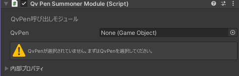
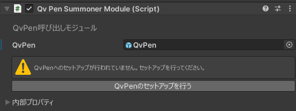
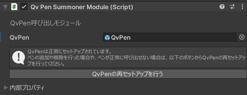

# QvPen呼び出しモジュール

|QvPen最低対応バージョン|動作確認済みバージョン|
|---|---|
|v3.3.4|v3.3.5|

## セットアップ方法
設定画面内にある「QvPen」の項目にQvPenのPrefabを設定します。  
  

正しいPrefabが選択出来ていれば以下のようなメッセージが表示されるので、「QvPenのセットアップを行う」ボタンをクリックしてセットアップを行います。  
  

「QvPenは正常にセットアップされています」と表示されていればセットアップは完了です。  
  
