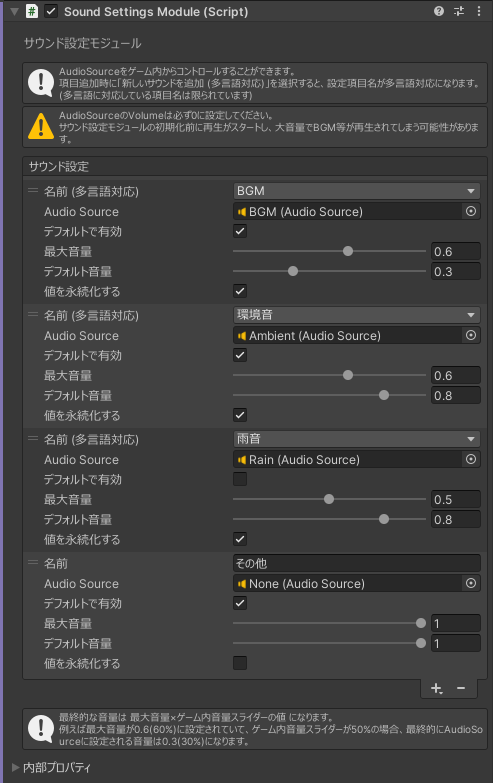

# サウンド設定モジュール

## 設定項目

サウンド設定モジュール右下の「+」から設定項目を追加することができます。  
`新しいサウンドを追加 (多言語対応)` を選択すると、プレイヤーの言語設定に応じた設定項目名に (ローカライズ) することができますが、設定できる項目名は限られています。  
自由に設定項目名を設定したい場合は、`新しいサウンドを追加` を選択してください。  
  

### AudioSource
再生に使用するAudioSourceを設定します。  
::: warning
AudioSourceのVolumeは必ず0に設定してください！  
サウンド設定モジュールの初期化前に再生がスタートし、大音量でBGM等が再生されてしまう可能性があります。
:::

### デフォルトで有効
初期状態で有効にするかどうかを設定します。

### 最大音量
AudioSourceのVolumeの最大音量を設定します。  

### デフォルトの音量  
初期状態でのゲーム内音量スライダーの値を設定します。  

::: tip 音量について
最終的にAudioSourceのVolumeに設定される値は `最大音量 * ゲーム内音量スライダーの値` になります。  
例えば最大音量が0.6(60%)に設定されていて、ゲーム内音量スライダーが50%の場合、最終的にAudioSourceのVolumeに設定される値は0.3(30%)になります。
:::