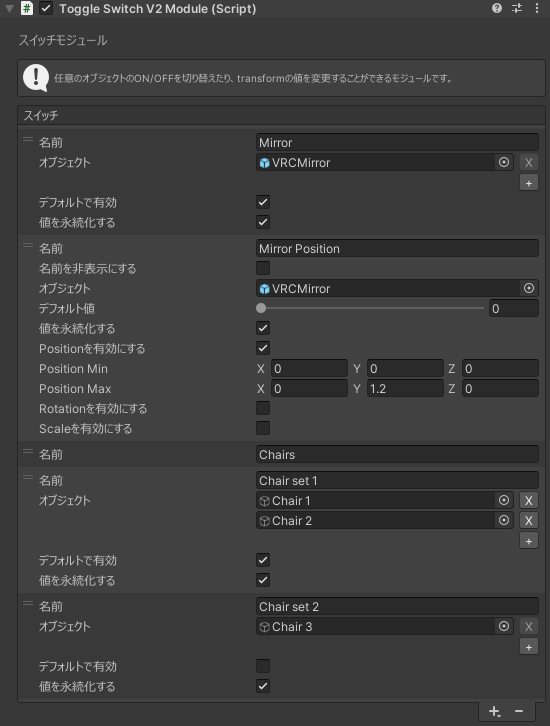

# スイッチモジュール
## 設定項目

スイッチモジュール右下の「+」からセクションとスイッチを追加することができます。  

### セクション
スイッチのグループのタイトルに使用することができます。

### スイッチ
任意のオブジェクトの有効/無効を切り替えることができます。

#### 名前
スイッチの名前を設定します。

#### オブジェクト
有効/無効を切り替えるオブジェクトを設定します。

#### デフォルトで有効
初期状態でオブジェクトを有効にするかどうかを設定します。