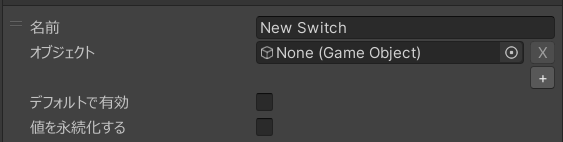
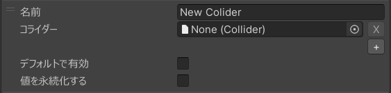
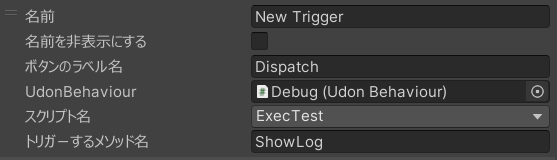

# スイッチモジュール

[[toc]]

## 設定項目

スイッチモジュール右下の「+」からセクション、スイッチ、トランスフォーム、コライダー、トリガーを追加することができます。  

::: info
「トランスフォームを追加」や「コライダーを追加」がない場合は、[レガシー版からの移行方法](#migrate-v2)に従って、新しいスイッチモジュールに移行してください。
:::

### セクション
スイッチのグループのタイトルに使用することができます。

### スイッチ
任意のオブジェクトの有効/無効を切り替えることができます。

#### 名前
スイッチの名前を設定します。

#### オブジェクト
有効/無効を切り替えるオブジェクトを設定します。

::: tip
オブジェクト設定欄の真下にある「+」を押すことで切り替えるオブジェクトを追加することができます。  
追加したオブジェクトは設定欄の右側にある「X」を押すことで削除することができます。  

:::

#### デフォルトで有効
初期状態でオブジェクトを有効にするかどうかを設定します。

#### 値を永続化する
オブジェクトの有効状態を永続化するかどうかを設定します。

::: info
グローバルが有効な場合は永続化設定が行えません (強制的に無効になります)。
:::

#### グローバル
オブジェクトの有効状態を同期するかどうかを設定します。  

### トランスフォーム {#transform}
指定したオブジェクトの位置、回転、スケールをスライダーで操作できます。  
挙動や仕様については[Transformの仕様について](#transform-spec)をご覧ください。

#### 名前
スライダー上部に表示される名前を設定します。

#### 名前を非表示にする
スライダー上部に表示される名前を非表示にすることができます。

#### オブジェクト
操作するオブジェクトを設定します。

#### デフォルト値
スライダーの初期値を設定します。

#### 値を永続化する
スライダーの値を永続化するかどうかを設定します。

::: info
グローバルが有効な場合は永続化設定が行えません (強制的に無効になります)。
:::

#### グローバル
スライダーの値を同期するかどうかを設定します。  

#### Positionを有効にする
対象となるオブジェクトのTransformのPositionを操作するかどうかを設定します。

#### Position Min / Position Max
Positionの最小値と最大値を設定します。  
X, Y, Zの値は相対値で設定してください。

#### Rotationを有効にする
対象となるオブジェクトのTransformのRotationを操作するかどうかを設定します。

#### Rotation Min / Rotation Max
Rotationの最小値と最大値を設定します。  
X, Y, Zの値は相対値で設定してください。

#### Scaleを有効にする
対象となるオブジェクトのTransformのScaleを操作するかどうかを設定します。

#### Scale Min / Scale Max
Scaleの最小値と最大値を設定します。  
X, Y, Zの値は相対値で設定してください。

### コライダー {#collider}
指定したオブジェクトのコライダーの有効/無効を切り替えることができます。

#### 名前
スイッチの名前を設定します。

#### コライダー
有効/無効を切り替えるコライダーを設定します。

#### デフォルトで有効
初期状態でコライダーを有効にするかどうかを設定します。

#### 値を永続化する
コライダーの有効状態を永続化するかどうかを設定します。

::: info
グローバルが有効な場合は永続化設定が行えません (強制的に無効になります)。
:::

#### グローバル
コライダーの有効状態を同期するかどうかを設定します。  

### トリガー {#trigger}
指定したUdonBehaviourに対して`SendCustomEvent`を実行することができます。  

#### 名前
トリガーの名前を設定します。  

#### 名前を非表示にする
トリガーボタン上部に表示される名前を非表示にすることができます。  

#### グローバル
トリガーボタンが押された時に同期 (=他のユーザーの環境でもトリガー) するかどうかを設定します。  

#### ボタンのラベル名
トリガーボタンに表示されるラベル名を設定します。  

#### UdonBehaviour
`SendCustomEvent`を実行するUdonBehaviourを設定します。  

#### スクリプト名
UdonBehaviourで指定されたオブジェクトにアタッチされているUdonBehaviourのスクリプト名を選択します。  
複数のUdonBehaviourがアタッチされている場合は、ここから`SendCustomEvent`を実行するスクリプトを選択することができます。  

#### トリガーするメソッド名
`SendCustomEvent`でトリガーするメソッド名を設定します。  
対象のメソッドは、UdonBehaviourの`SendCustomEvent`で呼び出せるメソッドである必要があります。  

## Transformの仕様について {#transform-spec}
Transformで指定できるPosition / Rotation / Scaleの値は相対的に指定する必要があります。    
例えば現在Hierarchyに配置されている`VRCMirror`というオブジェクトがあったとして、
- Unity上でPositionが `3, 1.5, 0` に設定されている
- スイッチモジュールのトランスフォームでPosition Minに`0, 0, 0`、Position Maxに`0, 1, 0`を設定した

という場合に、最終的に`VRCMirror`に設定されるPositionは以下のとおりになります。

- スライダーの値が0%の場合: `3, 1.5, 0`
- スライダーの値が100%の場合: `3, 2.5, 0`

### サンプル
  

#### オブジェクト自体の初期値

#### トランスフォームの値

## レガシー版からの移行方法 {#migrate-v2}
v1.2.0から、従来のスイッチモジュールは名称が「スイッチモジュール (レガシー)」に変更されました。  
スイッチモジュール(レガシー)を選択してから「ここをクリックして移行」を押すことで、新しいスイッチモジュールに現在の設定を引き継ぐことができます。
