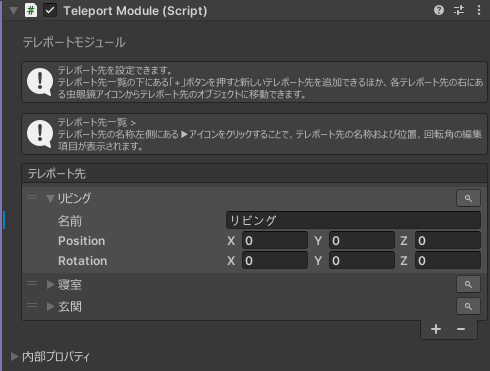
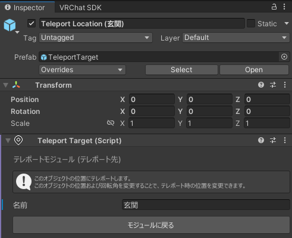

# テレポートモジュール
## 設定項目
  
テレポート先一覧の右下にある「+」からテレポート先を追加することができます。  

### テレポート先  
テレポート先の名称左側にある▶アイコンをクリックすることで、テレポート先の名称および位置、回転角の編集項目が表示されます。  

::: tip
テレポート先名称の右にある虫眼鏡アイコンからテレポート先のオブジェクトに移動できます。
:::

#### 名前
テレポート先の名称を設定します。  
ここで設定された名前がテレポート先一覧に表示されます。  

#### Position
テレポート先の位置を設定します。  

#### Rotation
テレポート先の回転角を設定します。  

## テレポート先オブジェクト
テレポート先として追加されたオブジェクトには `テレポートモジュール (テレポート先)` がアタッチされます。  
この箇所からもテレポート先名称を変更することが出来るほか、Transformの値を編集することでテレポート先の位置、回転角を変更することができます。  
「モジュールに戻る」ボタンを押すことで、テレポートモジュールに戻ることができます。  

