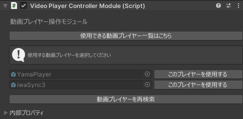
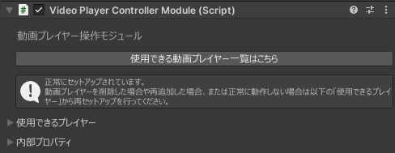
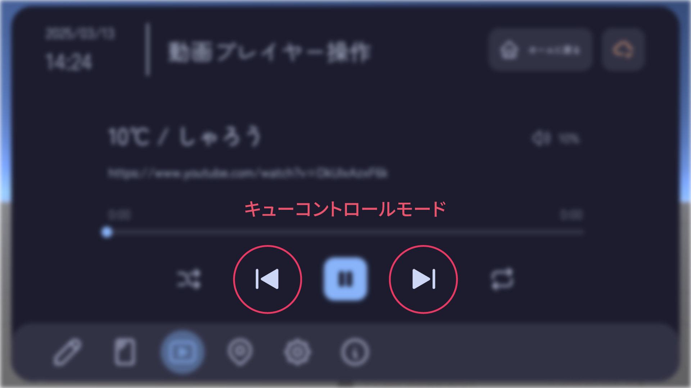
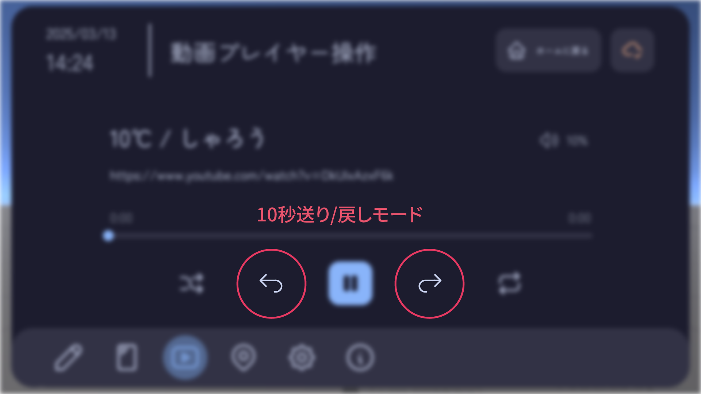

# 動画プレイヤー操作モジュール

## 使用可能なプレイヤー一覧 {#player-list}
動画プレイヤーによっては一部の機能が使用できない場合があります。  
使用できる動画プレイヤーおよび機能は以下の通りです。  

|プレイヤー名|動作確認済みバージョン|シャッフル切り替え|音量コントロール|キューのコントロール[^1]|
|---|---|---|---|---|
|[iwaSync3](https://booth.pm/ja/items/2666275)|v3.6.16|:x:|:heavy_check_mark:|:x:|
|[YamaPlayer](https://booth.pm/ja/items/4768863)|v1.5.13|:heavy_check_mark:|:heavy_check_mark:|:heavy_check_mark:|
|[KineL式(りら式) VideoPlayer](https://booth.pm/ja/items/2758684)|v2.5.5|:x:|:x:|:x:|
|[VizVid](https://booth.pm/ja/items/5056077)|v1.4.5|:heavy_check_mark:|:heavy_check_mark:|:heavy_check_mark:|
|[USharpVideo](https://github.com/DrBlackRat/USharpVideoModernUI) (USharpVideoModernUI)[^2]|v1.1.2|:heavy_check_mark:|:x:|:heavy_check_mark:|
|[ProTV](https://protv.dev/)|v3.0.0-beta.24.1|:x:|:heavy_check_mark:|:x:|
  
::: info
動画の再生/一時停止、再生位置の変更(シーク)、ループ再生の切り替えは全てのプレイヤーで使用可能です。
:::

::: tip
動作確認済みバージョンとして記載されているバージョン以外でも動作する可能性はありますが、動作保証はできません。  
定期的に各動画プレイヤーの最新バージョンでの動作確認および動作対応を行う予定です。
:::

## セットアップ方法
  
コントロールしたい動画プレイヤー(オブジェクト)名の右にある「このプレイヤーを使用する」ボタンをクリックすることで、自動的にセットアップが行われます。  
以下のようなメッセージが表示されていれば、セットアップは完了です。  
  

::: tip
再セットアップを行いたい場合、またはコントロールしたい動画プレイヤーを変更したい場合は「使用できるプレイヤー」から再セットアップを行うことができます。  
:::

[^1]: 次の動画にスキップ/戻ることができる機能です。未対応の場合や対応していてもキューに動画がない場合、また再生リストが利用できない場合などには10秒送り/戻しになります。
  
  

[^2]: USharpVideoのフォークである[USharpVideoModernUI](https://github.com/DrBlackRat/USharpVideoModernUI)に対応しています。[本家USharpVideo](https://github.com/MerlinVR/USharpVideo)には対応していません。